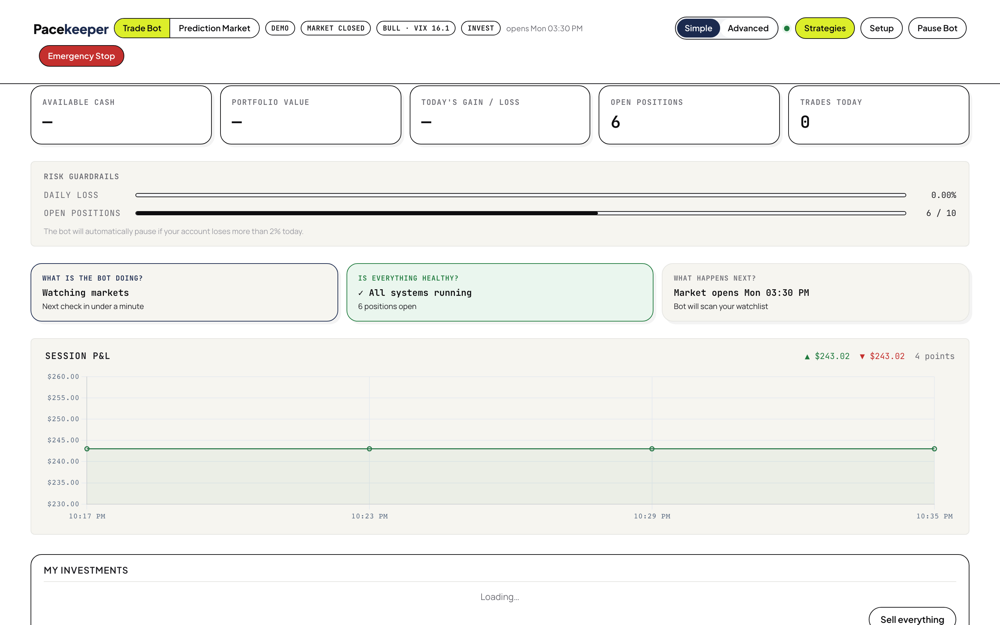
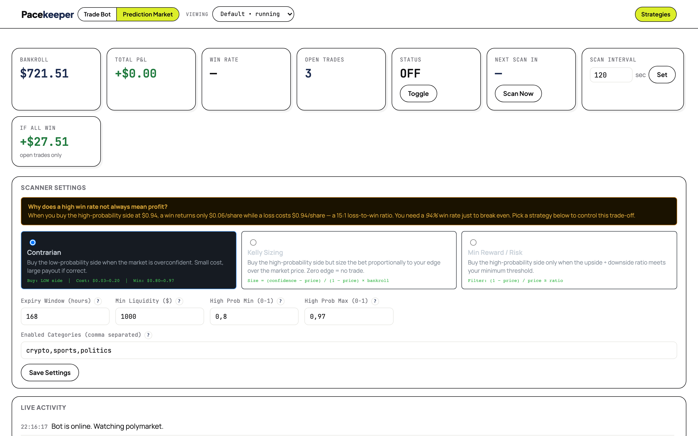

# Pacekeeper

AI-powered trading bots for Trading212 and prediction markets, with a web dashboard and a desktop app.

One license covers both bots. Get your key from the [Pacekeeper product page](https://wallstrdev.com/product/pacekeeper-ai-trading-bot-suite-for-trading212-prediction-markets/) — free during launch. See [License](#license).

## Screenshots

**Trade Bot** — risk guardrails, session P&L, plain-English status:



**Prediction Market Bot** — scanner strategies, bankroll, live activity:



## Easiest way: Desktop App

Download the latest installer from [Releases](https://github.com/pkhaninejad/pacekeeper-trading-bot/releases) — `.dmg` for macOS, `.msi` for Windows. The app walks you through license activation, broker connection, and AI provider setup; no terminal needed.

## Which bot is which

- `stock_bot.py` — stock trading bot (Trading212), dashboard at [http://localhost:4000](http://localhost:4000)
- `prediction_bot/main.py` — prediction market bot, dashboard at [http://localhost:4001](http://localhost:4001)

## Quick Start (from source)

### 1. Create the virtual environment and install dependencies

```bash
python3 -m venv .venv
.venv/bin/pip install -r requirements.txt
```

Always use the project venv binaries (`.venv/bin/python` / `.venv/bin/pip`), not system Python.

### 2. Configure environment

```bash
cp .env.example .env
```

Set these required values in `.env`:

- `T212_API_KEY`
- `T212_API_SECRET`
- `ANTHROPIC_API_KEY` (or configure another AI provider in the dashboard's Setup wizard)

Recommended while testing:

- `T212_ENV=demo` (paper trading)
- `BOT_ENABLED=false` (start in safe/manual mode)

### 3. Start the stock trading bot

```bash
.venv/bin/python stock_bot.py
```

Open [http://localhost:4000](http://localhost:4000). The first-run Setup wizard handles license activation, broker credentials, AI provider (Anthropic, OpenAI, Gemini, DeepSeek, Qwen, or local Ollama), and risk profile — it is the single place to configure these.

### 4. Run the prediction bot

```bash
.venv/bin/python -m prediction_bot.main
```

Dashboard: [http://localhost:4001](http://localhost:4001)

## Verify the bot is running

```bash
curl http://localhost:4000/api/status
```

You should get JSON with bot status fields. Trigger one manual cycle from the dashboard or:

```bash
curl -X POST http://localhost:4000/api/cycle
```

## Safety-first test flow

1. Keep `T212_ENV=demo`
2. Keep `BOT_ENABLED=false`
3. Start the app and confirm the dashboard loads
4. Trigger one manual cycle (`POST /api/cycle`)
5. Review signals/trades in the dashboard
6. Only then set `BOT_ENABLED=true` if behavior looks correct

## Run With Docker

```bash
cp .env.example .env
# edit .env first
docker-compose up --build
```

Dashboard: [http://localhost:4000](http://localhost:4000)

## Desktop App development

- Source: `desktop-app/` — React + TypeScript UI, Rust (Tauri) native bridge.
- Prerequisite: Rust toolchain via [rustup](https://rustup.rs/).

```bash
cd desktop-app
pnpm install
pnpm tauri:dev
```

Note: `pnpm dev` runs a browser preview only; process controls (start/stop bots) require the Tauri runtime via `pnpm tauri:dev`.

Local builds: `./scripts/build_desktop_macos.sh` / `./scripts/build_desktop_windows.ps1`. CI builds artifacts via `.github/workflows/desktop-build.yml`; tagged `v*.*.*` pushes publish signed installers via `.github/workflows/release.yml`.

### macOS signing / notarization

If macOS shows `"<App> is damaged and can't be opened"`, the build was not signed/notarized. Tagged releases need these repository secrets: `APPLE_CERTIFICATE` (base64 `.p12`), `APPLE_CERTIFICATE_PASSWORD`, `APPLE_SIGNING_IDENTITY`, `APPLE_ID`, `APPLE_PASSWORD` (app-specific), `APPLE_TEAM_ID`.

Temporary local unblock for internal testing only:

```bash
xattr -dr com.apple.quarantine /Applications/Pacekeeper.app
```

## Common Issues

- `ModuleNotFoundError`: you used system Python — re-run with `.venv/bin/python` / `.venv/bin/pip`.
- Dashboard not reachable: confirm the server is running and check `DASHBOARD_PORT` in `.env` (default `4000`).
- No trades/signals: check API keys, market hours, and account constraints; trigger a manual cycle and inspect logs.
- "License error" on bot start: activate a valid license key in the desktop app Settings or the dashboard Setup wizard.

## Key Environment Variables

- `T212_API_KEY`, `T212_API_SECRET`, `T212_ENV` (`demo` or `live`)
- `ANTHROPIC_API_KEY`
- `BOT_ENABLED`, `TRADE_INTERVAL_SECONDS`
- `MAX_OPEN_POSITIONS`, `MAX_POSITION_SIZE_PCT`
- `STOP_LOSS_PCT`, `TAKE_PROFIT_PCT`
- `WATCHLIST`, `DASHBOARD_PORT`

See `src/config/settings.py` for the full list and defaults.

## Disclaimer

Trading involves substantial risk of loss. This software is provided as a tool, not financial advice; you are solely responsible for any trades it executes on your account. Use `T212_ENV=live` only when you intentionally want real-money trading.

## License

Source-available under the [PolyForm Noncommercial License 1.0.0](LICENSE).
Free for personal, noncommercial use. **Commercial use requires a paid license** — contact khaninejad@gmail.com or purchase at [wallstrdev.com](https://wallstrdev.com).
